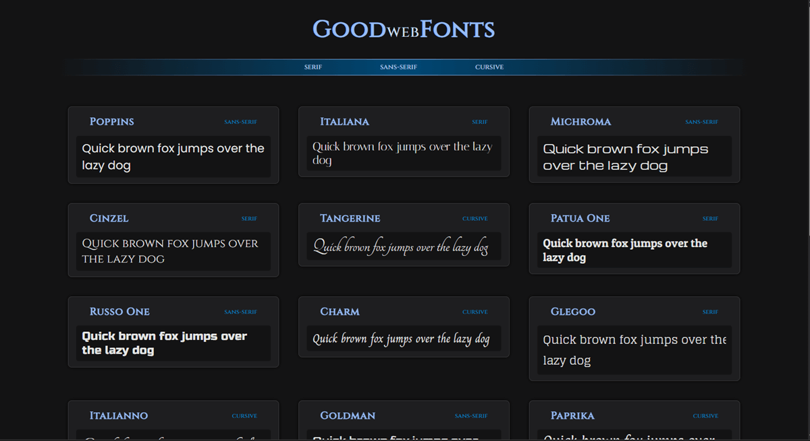
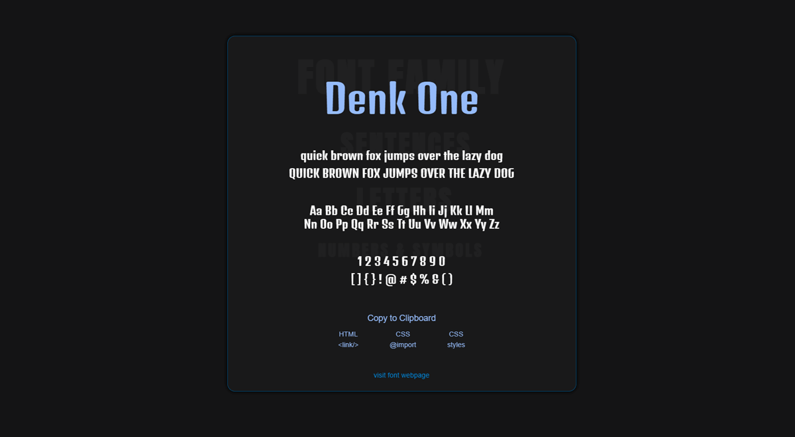

## Good Web Fonts App

### Created app with choices of good fonts for the web.

App is based on Goggle Fonts page color scheme in dark mode, with view transitions, detailed font pages and filtering by font type functionality.

#### Some technologies used for this APP might not work on all browsers!
____

#### View Transition staggers if a lot of transitioned elements are one the screen and, sometimes, not playing properly...

#### Tryed out HSL() function for creating different color shades based on main color.
--theme-clr: hsl(203, 100%, 23%);

color: hsl(from var(--theme-clr) h s calc(l + 25));
##### HSL() color creating functionality doesn't work in border colors

#### Visually hidding elements in the DOM with this class
<pre>.visually-hidden {
    clip: rect(0 0 0 0);
    clip-path: inset(50%);
    height: 1px;
    overflow: hidden;
    position: absolute;
    white-space: nowrap;
    width: 1px;
}
</pre>

---

##### Not happy with how I did Copy to Clipboard functionality

##### No idea why pseudo elements position or go in second row happens for some font families...

#### Hidden attribute now works on grid and flex-box elements?!

---

#### About CSS view transitions
[Video tut](https://www.youtube.com/watch?v=quvE1uu1f_I)
[Video doc](https://www.youtube.com/watch?v=DtErR1UUyiU)
[MDN docs](https://developer.mozilla.org/en-US/docs/Web/CSS/::view-transition-group)

___

##### Manual for capturing sample screenshots from Google Fonts webpage, with monitor screen resolution of 1680 x 1050

<small>1. copy the sentence in filter side bar's textbox</small>

<small>2. set the font size to 24px (can be exceptions for some fonts...)</small>

<small>3. keep the filter sidebar open</small>

<small>4. console opened and set on the right and shrinked all the way to the right</small>

<small>5. result list on google fonts site should be displayed as grid</small>

<small>6. than do a capture node screenshot of the image of font letters</small>

##### that way screenshot captured should be 377px in width!